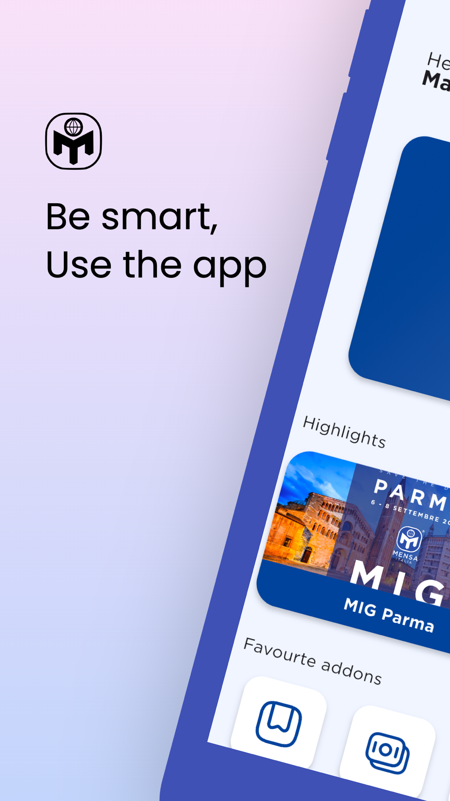
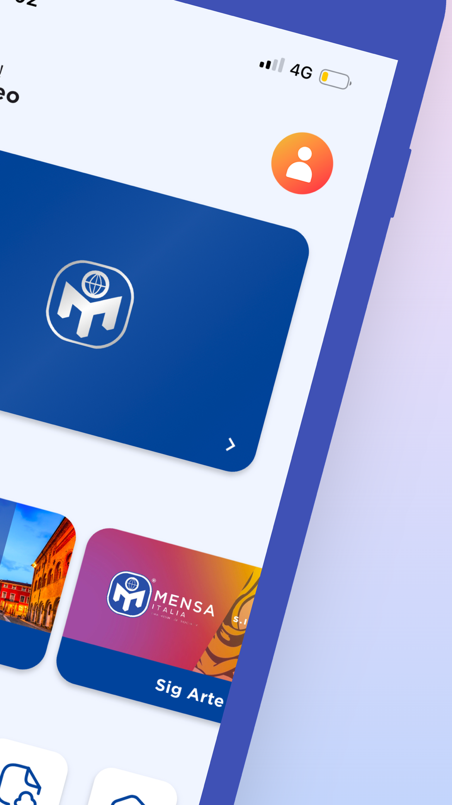
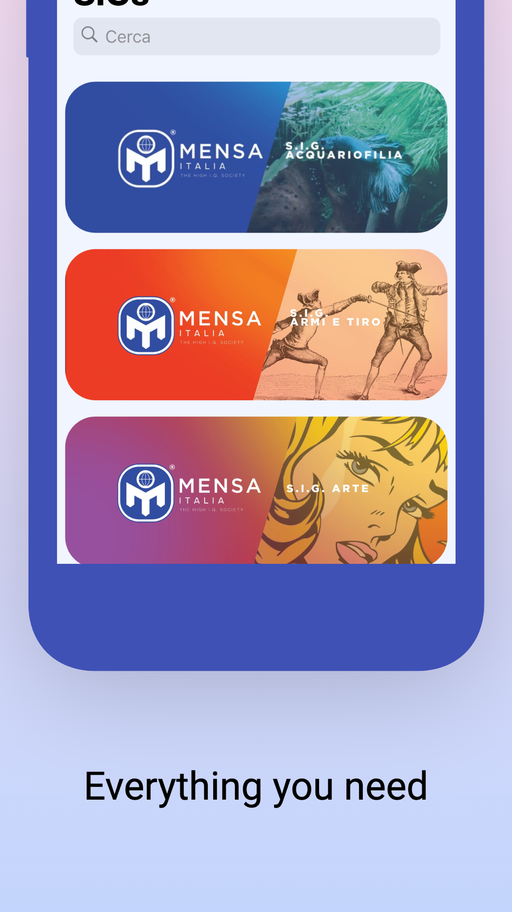
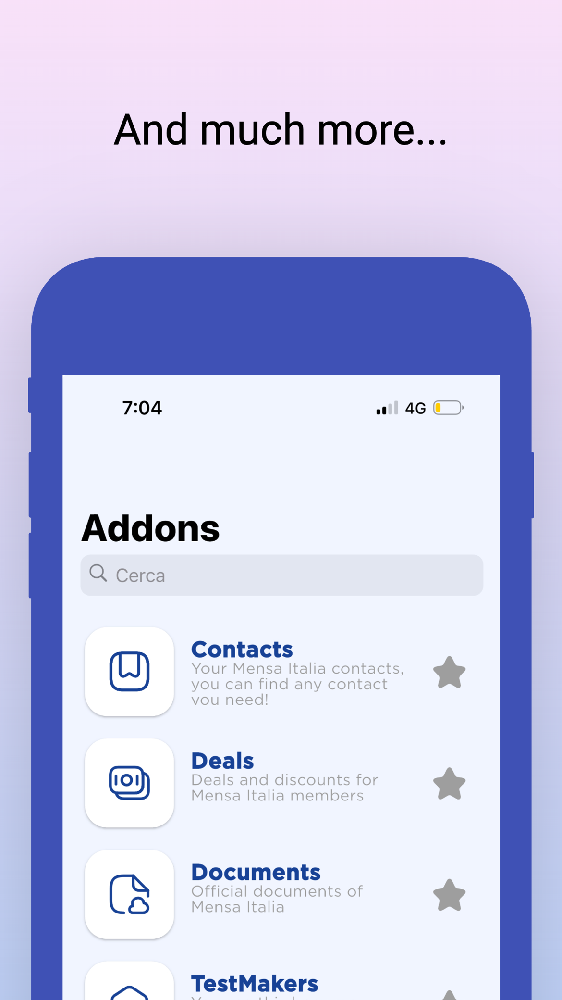
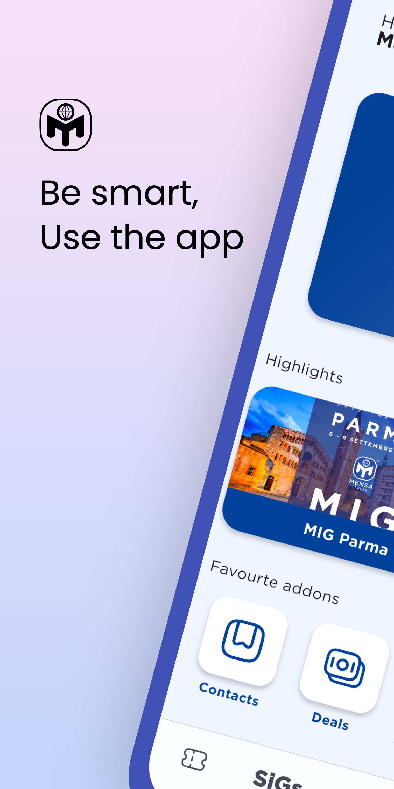
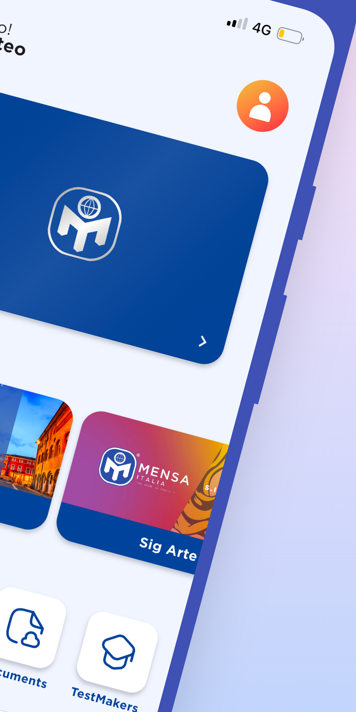
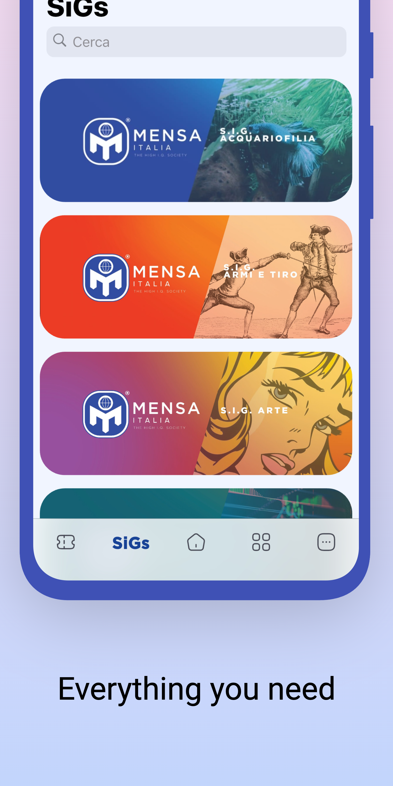
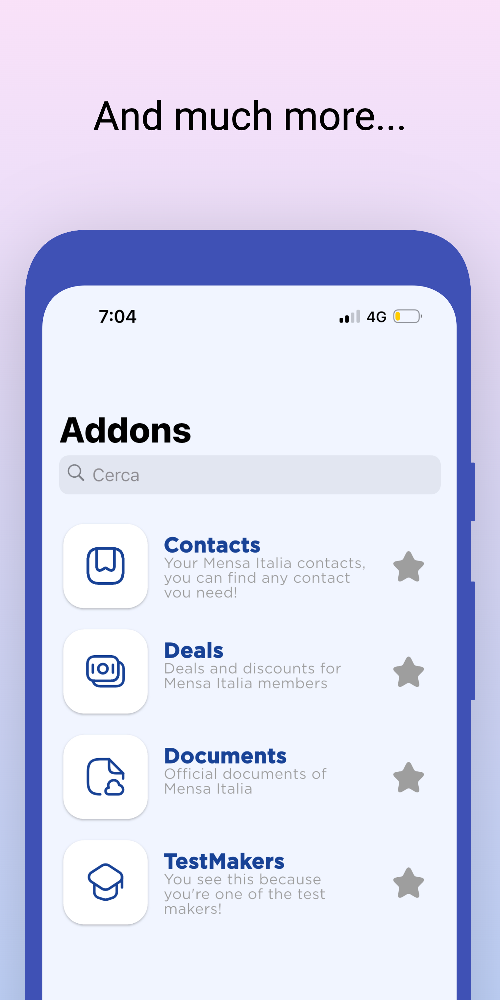

<h1 align="center">Mensa Italia App</h1>

<p align="center">
  <em>L'applicazione mobile ufficiale di Mensa Italia per iOS e Android.</em>
</p>

<p align="center">
  <a href="https://github.com/Mensa-Italia/mensa_italia_app/releases"></a>
  <a href="https://flutter.dev"></a>
  <a href="https://dart.dev"></a>
  <a href="LICENSE"></a>
  <a href="https://apps.apple.com/it/app/mensa-italia/id1524200080"></a>
  <a href="https://play.google.com/store/apps/details?id=it.mensa.app"></a>
</p>

<table align="center">
  <tr>
    <th align="center">iOS build</th>
    <th align="center">Android build</th>
  </tr>
  <tr>
    <td align="center"><a href="https://codemagic.io/app/5e9c113c18efc2f5280237db/5e9c113c18efc2f5280237da/latest_build"></a></td>
    <td align="center"><a href="https://codemagic.io/app/5e9c113c18efc2f5280237db/66acb863e713f465afc6fe46/latest_build"></a></td>
  </tr>
</table>

---

## Panoramica

**Mensa Italia App** è il client mobile cross-platform che consente ai soci di Mensa Italia di accedere a tutti i servizi digitali dell'associazione: tessera digitale, calendario eventi, SIG (Special Interest Groups), directory soci, offerte partner, documenti ufficiali, timbri Tableport, boutique, donazioni e pagamenti, notifiche push e addon esterni firmati.

L'app è scritta in **Flutter** con pattern **MVVM** (via [`stacked`](https://pub.dev/packages/stacked)) e si interfaccia con un backend dual-stack:

- **PocketBase** principale su `https://svc.mensa.it` — API REST + sottoscrizioni realtime via SSE.
- **Cloud32 / Area32** legacy (`cloud32.it`) — scraping HTML per anagrafica storica, testelab e archivio documentale.

Il codice sorgente del backend è pubblicato in [Mensa-Italia/mensa_online](https://github.com/Mensa-Italia/mensa_online).

## Screenshot

Screenshot ufficiali pubblicati su [App Store](https://apps.apple.com/it/app/mensa-italia/id1524200080) e [Google Play](https://play.google.com/store/apps/details?id=it.mensa.app).

### iPhone

<table>
  <tr>
    <td align="center"><br><sub>Home</sub></td>
    <td align="center"><br><sub>Tessera</sub></td>
    <td align="center"><br><sub>SIG</sub></td>
    <td align="center"><br><sub>Addons</sub></td>
  </tr>
</table>

### Android

<table>
  <tr>
    <td align="center"><br><sub>Home</sub></td>
    <td align="center"><br><sub>Tessera</sub></td>
    <td align="center"><br><sub>SIG</sub></td>
    <td align="center"><br><sub>Addons</sub></td>
  </tr>
</table>

## Funzionalità

- Tessera socio digitale con stato di rinnovo e Apple/Google Wallet card
- Eventi nazionali e locali (lista, calendario, mappa, creazione e scheduling)
- SIG — Special Interest Groups, iscrizione e gestione
- Directory soci (RegSoci) e compleanni del giorno
- Addon ecosistema:
  - **Tableport** — timbri evento con scansione QR
  - **Boutique** — e-commerce gadget ufficiali
  - **Offerte** — convenzioni e sconti per soci
  - **Contatti** — rubrica soci referenti
  - **Documenti** — archivio atti, bilanci, verbali
  - **Test Assistant** — gestione sessioni d'esame per testmaker
  - **External webview** — addon di terze parti lanciati con payload firmato
- Notifiche push (Firebase Cloud Messaging) con preferenze geolocalizzate
- Realtime via PocketBase SSE per notifiche, tickets e ricevute
- Pagamenti e donazioni via Stripe
- Deep linking via `mensa://` e Universal Link `svc.mensa.it/links`
- Localizzazione in 10 lingue via Tolgee (en, it, es, de, fr, bn, zh, hi, ja, pt)

## Stack tecnologico

| Categoria | Tecnologia |
|---|---|
| Framework | Flutter 3.4.4 · Dart `>=3.0.3 <4.0.0` |
| Pattern | Stacked (MVVM) + `stacked_generator` |
| HTTP client | `dio` + `native_dio_adapter` |
| Backend primario | `pocketbase` SDK → `https://svc.mensa.it` |
| Backend legacy | Scraper HTML per `cloud32.it/Associazioni` |
| Data models | `freezed` + `json_serializable` |
| DB locale | ObjectBox |
| Storage sicuro | `flutter_secure_storage` |
| Cookie | `PersistCookieJar` (file storage) |
| i18n | `easy_localization` + custom AssetLoader Tolgee |
| Push | `firebase_messaging` |
| Realtime | PocketBase SSE |
| Mappe | `maplibre_gl` + Google Maps API + `place_picker_google` |
| Pagamenti | `flutter_stripe` |
| PDF viewer | `syncfusion_flutter_pdfviewer` |
| QR scan | `mobile_scanner` |
| Deep link | `app_links` |
| CI/CD | Codemagic |

## Prerequisiti

- [Flutter 3.4.4](https://docs.flutter.dev/release/archive) (versione esatta pinnata in `pubspec.yaml`)
- Dart SDK `>=3.0.3 <4.0.0` (incluso in Flutter)
- **iOS:** Xcode 15+, CocoaPods, macOS
- **Android:** Android Studio / SDK, JDK 11+
- Account Firebase con accesso al progetto `mensa-platform` per ottenere:
  - `android/app/google-services.json`
  - `ios/Runner/GoogleService-Info.plist`

## Setup

```bash
# 1. Clone
git clone https://github.com/Mensa-Italia/mensa_italia_app.git
cd mensa_italia_app

# 2. Installazione dipendenze
flutter pub get

# 3. Code generation (obbligatoria — freezed, json_serializable, stacked, objectbox)
dart run build_runner build --delete-conflicting-outputs

# 4. Copia i file Firebase nelle posizioni richieste
#    android/app/google-services.json
#    ios/Runner/GoogleService-Info.plist

# 5. iOS: install pods
cd ios && pod install && cd ..

# 6. Esegui in debug
flutter run
```

### Build release

```bash
# Android App Bundle
flutter build appbundle --release

# iOS (richiede firma valida)
flutter build ios --release
```

Per firmare la build Android in locale crea `android/key.properties`:

```properties
storeFile=/percorso/assoluto/al/keystore.jks
storePassword=***
keyAlias=***
keyPassword=***
```

In Codemagic le stesse variabili sono lette da `CM_KEYSTORE_PATH`, `CM_KEYSTORE_PASSWORD`, `CM_KEY_ALIAS`, `CM_KEY_PASSWORD`.

## Struttura del progetto

```
mensa_italia_app/
├── android/                      # Progetto nativo Android (namespace it.mensa.app)
├── ios/                          # Progetto nativo iOS (bundle "Mensa")
├── macos/ linux/                 # Scaffolding desktop (non utilizzati)
├── assets/
│   ├── icons/                    # Icone launcher
│   ├── images/                   # Asset raster (marker, card, ecc.)
│   ├── svg/                      # Icone vettoriali
│   └── cards/                    # Card template
├── fonts/                        # Gotham (Book/Bold/Light/Medium/Thin)
├── locals/
│   └── it.json                   # Backup traduzioni (runtime le prende da Tolgee)
├── lib/
│   ├── main.dart                 # Bootstrap: Firebase, EasyLocalization, ObjectBox, timezone
│   ├── firebase_options.dart     # Config Firebase generata
│   ├── app/                      # Stacked codegen
│   │   ├── app.dart              # @StackedApp (routes, dialogs, bottom sheets)
│   │   ├── app.router.dart       # Generato
│   │   ├── app.locator.dart      # DI
│   │   ├── app.dialogs.dart
│   │   └── app.bottomsheets.dart
│   ├── api/
│   │   ├── api.dart              # Api singleton (PocketBase client, ~1200 righe)
│   │   ├── scraperapi.dart       # Scraper HTML Cloud32
│   │   ├── dio_area_interceptor.dart  # Auto re-login su 302
│   │   ├── memoized.dart         # Cache in-memory
│   │   └── translation_loader.dart    # AssetLoader Tolgee
│   ├── database/
│   │   └── database.dart         # Bootstrap ObjectBox
│   ├── model/                    # Modelli Freezed (26+)
│   ├── services/                 # SSE realtime (Notify/Ticket/Receipt) + MapsApiHeader
│   └── ui/
│       ├── common/               # MasterModel, app_colors
│       ├── views/                # 33 view + viewmodel (login, home, events, addon_*, ecc.)
│       ├── widgets/common/       # Widget condivisi
│       ├── dialogs/              # InfoAlert, InputText
│       └── bottom_sheets/        # Notice, helpers custom
├── test/                         # Unit test
├── firebase.json                 # Config CLI Firebase
├── pubspec.yaml                  # Dipendenze + version
└── release_notes.json            # Note di rilascio multi-lingua
```

## Configurazione

Il client legge la configurazione dinamica (chiavi Stripe, URL Tolgee, lista lingue) dal backend PocketBase al boot tramite `Api().settings()`. Non è necessario hard-coded extra oltre alla connessione Firebase.

| Configurazione | Origine |
|---|---|
| Base URL backend | `https://svc.mensa.it` (hard-coded in `lib/api/api.dart`) |
| Firebase project | `mensa-platform` |
| Stripe publishable key | PocketBase `configs.stripe_key` |
| Tolgee i18n URL | PocketBase `configs.i18n_structured_url` |
| Lista lingue | PocketBase `configs.languages` |
| URL scheme | `mensa://` |
| Universal link host | `svc.mensa.it/links` |
| Google Maps API key | `android/app/src/main/AndroidManifest.xml` |

## Documentazione

La documentazione tecnica completa è mantenuta nella [**Wiki del repository**](https://github.com/Mensa-Italia/mensa_italia_app/wiki):

- [Getting Started](https://github.com/Mensa-Italia/mensa_italia_app/wiki/Getting-Started) — setup esteso
- [Architecture Overview](https://github.com/Mensa-Italia/mensa_italia_app/wiki/Architecture-Overview) — architettura MVVM e dual backend
- [API Integration](https://github.com/Mensa-Italia/mensa_italia_app/wiki/API-Integration) — `Api` e `ScraperApi`
- [Data Models](https://github.com/Mensa-Italia/mensa_italia_app/wiki/Data-Models) — modelli Freezed
- [State Management & Navigation](https://github.com/Mensa-Italia/mensa_italia_app/wiki/State-Management-and-Navigation)
- [Authentication](https://github.com/Mensa-Italia/mensa_italia_app/wiki/Authentication)
- [Push Notifications & Realtime](https://github.com/Mensa-Italia/mensa_italia_app/wiki/Push-and-Realtime)
- [Localization](https://github.com/Mensa-Italia/mensa_italia_app/wiki/Localization)
- [Features & Addons](https://github.com/Mensa-Italia/mensa_italia_app/wiki/Features-and-Addons)
- [Build & Deployment](https://github.com/Mensa-Italia/mensa_italia_app/wiki/Build-and-Deployment)
- [Platform Configuration](https://github.com/Mensa-Italia/mensa_italia_app/wiki/Platform-Configuration)
- [Troubleshooting & FAQ](https://github.com/Mensa-Italia/mensa_italia_app/wiki/Troubleshooting)

## Contributing

I contributi sono benvenuti. Prima di aprire una Pull Request leggi le [Contributing Guidelines](https://github.com/Mensa-Italia/mensa_italia_app/wiki/Contributing-Guidelines) complete. In sintesi:

1. Fork del repository e branch dedicato (`feature/xxx` o `fix/xxx`)
2. `flutter pub get` + `dart run build_runner build --delete-conflicting-outputs`
3. `flutter analyze` deve essere pulito
4. `dart format .`
5. **Non committare** i file generati `*.freezed.dart`, `*.g.dart`, `app.router.dart`, `app.locator.dart` manualmente editati
6. Apri la PR contro `master` con descrizione dettagliata e riferimento all'issue

Per segnalare bug apri una [issue](https://github.com/Mensa-Italia/mensa_italia_app/issues) includendo versione app, piattaforma e passi per riprodurre. Per vulnerabilità di sicurezza contatta direttamente i maintainer (non aprire issue pubblica).

## License

Distribuito sotto licenza **GNU General Public License v2.0**. Vedi [`LICENSE`](LICENSE) per il testo completo.

## Link utili

- Sito ufficiale: [mensa.it](https://www.mensa.it)
- Issue tracker: [github.com/Mensa-Italia/mensa_italia_app/issues](https://github.com/Mensa-Italia/mensa_italia_app/issues)
- Wiki: [github.com/Mensa-Italia/mensa_italia_app/wiki](https://github.com/Mensa-Italia/mensa_italia_app/wiki)
- Backend: [github.com/Mensa-Italia/mensa_online](https://github.com/Mensa-Italia/mensa_online)
- CI iOS: [codemagic.io (iOS)](https://codemagic.io/app/5e9c113c18efc2f5280237db/5e9c113c18efc2f5280237da/latest_build)
- CI Android: [codemagic.io (Android)](https://codemagic.io/app/5e9c113c18efc2f5280237db/66acb863e713f465afc6fe46/latest_build)
